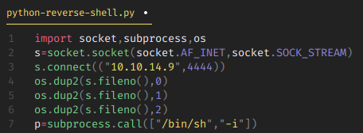

## Bashed | IP: 10.10.10.68

### Enumeration

##### nmap

##### Dirbuster

Dirbuster reveals, among other things, a ​`dev`​ directory which contains a functional copy of
`phpbash​` . This directory is hinted to in the blog post on the main site.

### Exploitation

We upload a php reverse shell onto the uploads directory which connects to our netcat listener

On seeing the output of `sudo -l`, we see that we can execute any command as the user `scriptmanager`

Looking at the information of the files in the directory shows that ​`test.py​` appears to be executed every minute. This can be inferred by reading ​`test.py`​ and looking at the timestamp of ​ `test.txt`​. The text file is owned by root, so it can also be assumed that it is run as a root cron job. A root shell can be obtained simply by modifying ​`test.py`​ or creating a new Python file in the `​/scripts` directory, as all scripts in the directory are executed

### PrivEsc

Let's create a python reverse shell.

To transfer the `python-reverse-shell.py` to the victim's machine, we encode it into base64 and copy it. Then paste and decode the same on the victim's machine.

As soon as we run `$ python test.py`, we get a shell as user `scriptmanager`. Exit out of it and run the listener again, this time we get shell as `root`.

### Reading Flags

### Trophy

