## Nibbles | IP: 10.10.10.75

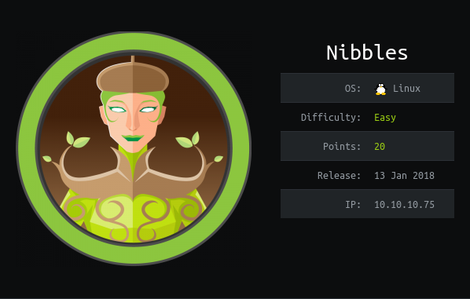

### Enumeration

#### nmap

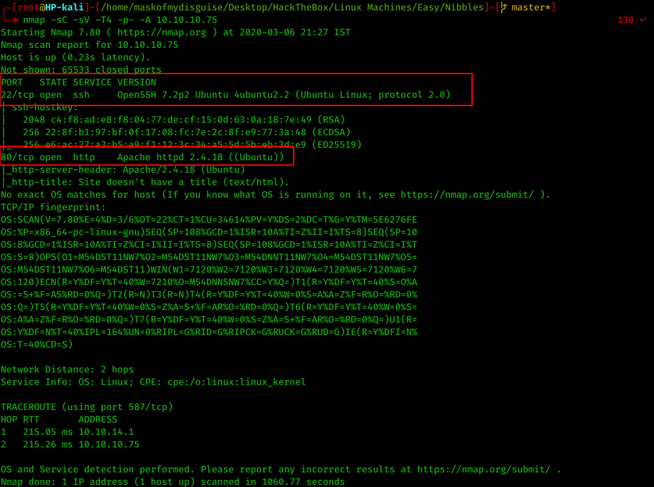

#### Information Disclosure

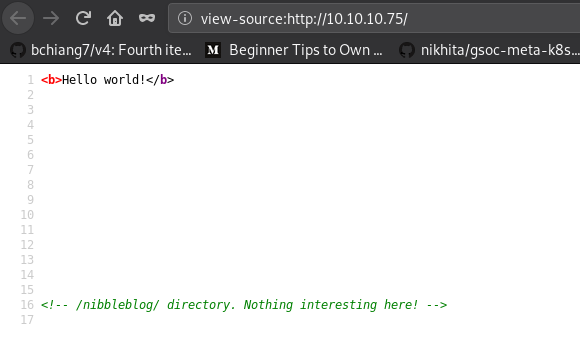

#### Searchsploit

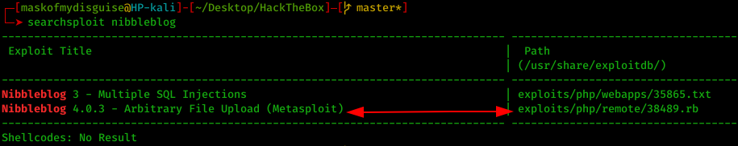

#### Initial Foothold

On,  `/nibbleblog/admin.php`, we have a login form. Trying the default credentials `admin:nibble`, let's us in.

### Exploitation

#### Owning User

>  Follow CVE-2015-6967: https://curesec.com/blog/article/blog/NibbleBlog-403-Code-Execution-47.html

> Note: We can also use the metasploit module: `multi/http/nibbleblog_file_upload`

1. Upload a PHP web shell,

	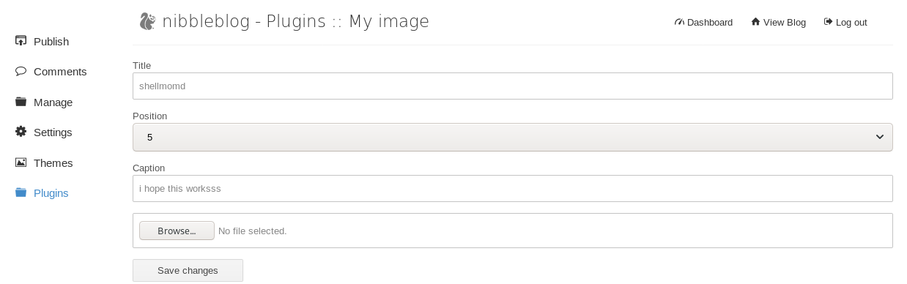

2. Go to `http://10.10.10.75/nibbleblog/content/private/plugins/my_image/image.php`

	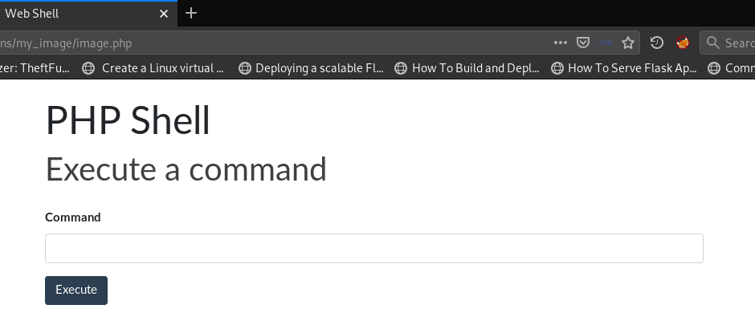

3. Now we have a shell as user `nibble`, we can use this to get a reverse shell, but we'd directly read the flag

	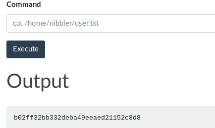

#### Owning Root - PrivEsc

1. Let's get a reverse shell,

	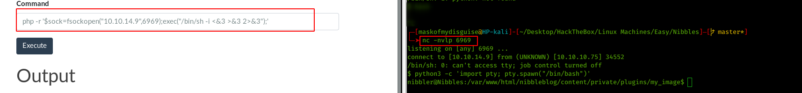

2. Now we see the contents of sudo -l,

	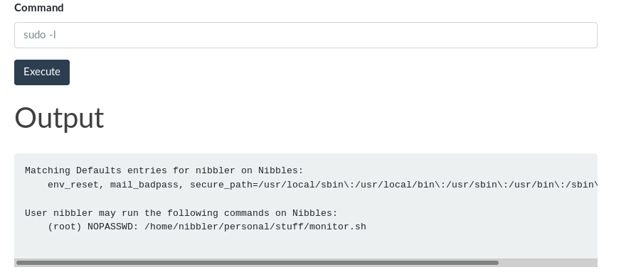

3. We can simply change the contents of `monitor.sh` file and then execute it with sudo,

	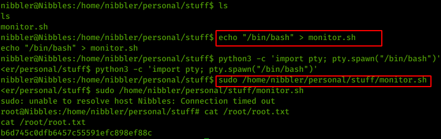
	
> Note: We can also run - https://github.com/mzet-/linux-exploit-suggester - on the machine to see various ways to escalate privileges/ do harm :)

#### Trophy

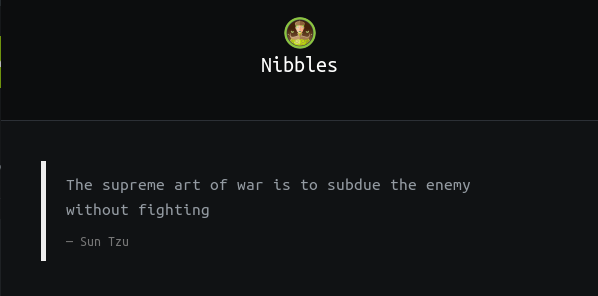