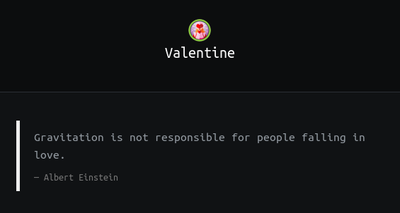

## Valentine | IP: 10.10.10.79


### Enumeration

##### nmap

```
nmap --script vuln -A 10.10.10.79
```

Results in: [`nmap.scan`](nmap.scan)

nmap scan reveals that the machine is vulnerable to the heartbleed (CVE-2014-0160)  vulnerability.

> XKCD: HeartBleed explained - https://xkcd.com/1354/


##### SSL scanner

```
$ sslyze --heartbleed 10.10.10.79
```

tells us the machine is vulnerable to heartbleed

##### Gobuster


Reveals a `/dev/` directory,


here the `hype_key` file is hex encoded, we decode it into ASCII using the convertor [here](https://www.rapidtables.com/convert/number/hex-to-ascii.html) and we get a RSA private key for user `hype` , but we still need the password.

From gobuster, we also get `/encode.php` and `/decode.php` which basically are base64 convertors.


### Exploitation

##### Owning User

> heartbleed.py - https://gist.github.com/eelsivart/10174134

Using the `heartbleed.py` exploit we get a base64 encoded string,


we now use the string: `heartbleedbelievethehype` as password to login via SSH as user `hype`.


##### PrivEsc

Running ​`ps aux | grep root`​ reveals a tmux session being run as the root user.


Simply running the command ​`tmux -S /.devs/dev_sess`​ will connect to the session, with full root
privileges.


> Note: Can also be exploited with [Dirty COW (CVE-2016-5195)](https://dirtycow.ninja/).

### Trophy

